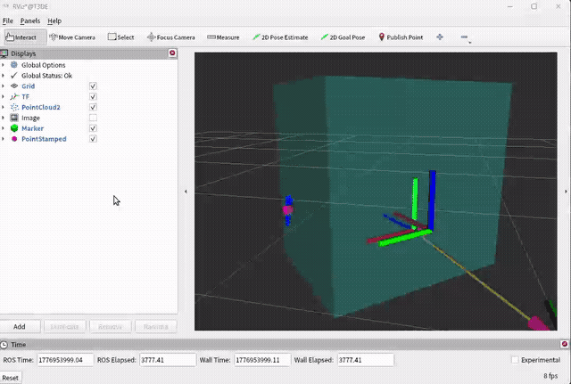

# handover_baseline

## 项目目的

本项目用于构建一套面向抓取/交接场景的 ROS2 感知与运动状态估计基线流程：  
通过双目深度、手部分割、点云筛选与目标状态估计，输出可供机械臂执行的抓取位姿与相关调试信息。

## 主体 Pipeline

主数据流如下（按运行链路）：

1. 相机驱动发布图像与相机参数（例如 RealSense）。
2. `fastfoundation` 基于双目图像推理深度。
3. `hand_detector` 生成手/目标区域分割掩码。
4. `pc_processor` 融合深度 + 分割 + ROI/工作空间约束，输出目标点云与质心。
5. `motion_state_estimator` 结合目标点与 TCP 位姿，输出抓取位姿（含调试点/工作空间可视化）。
6. `ur_robotiq` 与 `ur_robotiq_interfaces` 负责机械臂执行侧接口（位姿运动、夹爪控制）。

## 演示视频

- RViz 视角演示：`docs/video/rivz_light.gif`
- 跟踪流程演示：`docs/video/track_demo_light.gif`




## 子功能包

- `src/fastfoundation`：双目深度推理节点。
- `src/hand_detector`：分割节点。
- `src/pc_processor`：点云处理与目标识别节点。
- `src/motion_state_estimator`：抓取位姿估计节点。
- `src/ur_robotiq`：机械臂控制侧 ROS2 节点。
- `src/ur_robotiq_interfaces`：机械臂控制服务接口定义。

## 部署说明

> ⚠️ 部署前请先逐个阅读“各子包详细说明”（见下方链接），确认参数、话题、坐标系和资源路径都已对齐，再开始部署；否则很容易出现未知问题（无输出、坐标错位、控制拒收等）。

### 1) 环境与依赖

- Python 依赖请使用仓库根目录 `requmnet.txt` 安装。
- `numpy` 已锁定为 `1.26.*`。
- `torch` 需按本机环境（CPU/CUDA、驱动、CUDA 版本）单独安装，不在统一依赖中强制固定。

### 2) 编译

在工作空间根目录执行（按你的 ROS2 习惯）：

```bash
colcon build
source install/setup.bash
```

### 3) Fast-FoundationStereo 第三方部署说明（重要）

- `fastfoundation` 依赖第三方库 Fast-FoundationStereo，请按其官方说明自行完成部署。
- 模型权重与相关配置请按第三方说明自行下载，并放置到你配置的 `weight_dir`。
- 推荐根据你的硬件环境（GPU 型号、驱动、CUDA、TensorRT 版本）做 TensorRT 优化与 engine 构建，以获得更稳定的实时性能。

### 4) 启动顺序（建议）

```bash
# 1. 相机驱动（示例）
ros2 launch realsense2_camera rs_launch.py config_file:=/path/to/d455.yaml camera_name:=d455

# 2. 机械臂状态/控制节点
ros2 launch ur_robotiq pose_tracker.launch.py params_file:=/home/ender/handover_baseline/src/ur_robotiq/config/robot_config.yaml

# 3. 双目深度
ros2 launch fastfoundation launch_fastfoundation.launch.py \
  params_file:=/home/ender/handover_baseline/src/fastfoundation/config/d455.yaml \
  namespace:=d455

# 4. 分割
ros2 launch hand_detector hand_detector.launch.py \
  namespace:=d455 \
  config_file:=/home/ender/handover_baseline/src/hand_detector/config/config.yaml \
  image_topic:=/camera/d455/infra1/image_rect_raw

# 5. 点云处理/目标识别
ros2 launch pc_processor perception.launch.py \
  namespace:=d455 \
  config_file:=/home/ender/handover_baseline/src/pc_processor/config/d455_perception.yaml

# 6. 抓取位姿估计
ros2 launch handover_task base_policy.launch.py \
  config_file:=/home/ender/handover_baseline/src/handover_task/config/base_policy.yaml
```

### 5) 机械臂适配注意事项（重要）

- 本仓库默认控制接口以 `ur_robotiq` / `ur_robotiq_interfaces` 为参考实现。
- 你的机械臂若不是 UR+Robotiq，需单独实现自己的控制包。
- 新控制包建议对齐 `ur_robotiq_interfaces` 的服务语义与消息约定，保证上层流程最小改动可复用。

## 各子包详细文档占位

- [`fastfoundation` 详细说明](docs/packages/fastfoundation.md)
- [`hand_detector` 详细说明](docs/packages/hand_detector.md)
- [`pc_processor` 详细说明](docs/packages/pc_processor.md)
- [`motion_state_estimator` 详细说明](docs/packages/motion_state_estimator.md)
- [`ur_robotiq` 详细说明](docs/packages/ur_robotiq.md)
- [`ur_robotiq_interfaces` 详细说明](docs/packages/ur_robotiq_interfaces.md)

## 现有问题说明

- 当前 YOLO 分割能力不足，现有模型开发较仓促，无法稳定剔除整条手臂。
- 需要补一个可分割“手臂+手掌”的模型；否则当手臂深入点云工作区时，系统会把手臂误判为待抓物体，导致目标追踪失效。
- 目前抓取旋转角与抓取宽度无法可靠估计，抓稳主要依赖写死的力控参数与闭合宽度。
- 状态估计相关参数仍需持续调参（含滤波与阈值类参数），才能达到更稳定的实际效果。